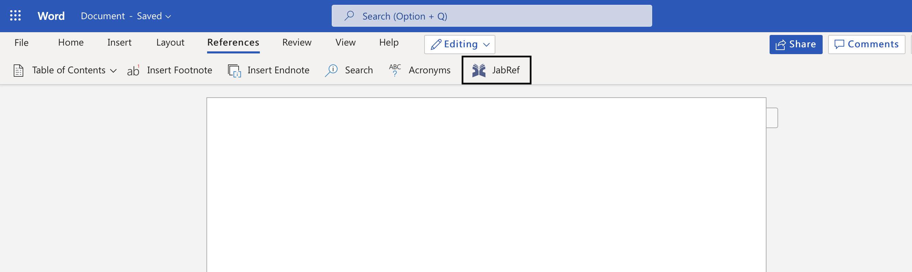

# JabRef-Word-Addin

## Getting started

- Install [Node.js](https://nodejs.org/).
- Create .env file in the root directory containing the `HOST_API_URL` key

  e.g., `API_HOST = "https://mango-pebble-0224c3803.1.azurestaticapps.net/"`

- Run `yarn install`

## Loading and Testing the Plugin

### How to test the add-in in Word

- Run `yarn start` in the root directory. This starts the local web server and opens Word with add-in loaded.
  On Windows, you have to do that with Administrator rights (at the very first run) in order to setup the correct certificates.
- In Word, open a new document, choose the Home tab, and then choose the Show Task Pane button in the ribbon to open the add-in task pane.

### How to test add-in in Word on a browser

- Open [Word](https://www.office.com/launch/word) on the web. Using the "New blank document" option, open a new Word document. In this new document, select Share in the ribbon, select Copy Link in the dropdown, and copy the URL.
- In the project root directory, open the `.env` file. Add a `DOCUMENT_URL` key with the URL you copied as the value. For example, `DOCUMENT_URL=<URL>`.
- In the command line starting at the root directory, run `yarn start:web`.
- The Word document should now be opened in a new browser tab. Confirm that you would like to enable developer mode (this is needed for sideloading addins).
- You will see a second dialog box, asking if you wish to register an Office Add-in manifest from your computer. Select Yes.
- Choose the Reference tab, and then click on the JabRef icon to open the add-in task pane.
  

### How to sideload Add-in in Office on the web manually

- Open Office on the web. Open a document in Word. On the Insert tab on the ribbon in the Add-ins section, choose Office Add-ins.
- On the Office Add-ins dialog, select the MY ADD-INS tab, choose Manage My Add-ins, and then Upload My Add-in.
- Browse to the add-in manifest file, and then select Upload.
- Choose the Reference tab, and then click on the JabRef icon to open the add-in task pane.

## Yarn Commands

| Command        | Description                                                                                                                                  |
| -------------- | -------------------------------------------------------------------------------------------------------------------------------------------- |
| `yarn start`     | To test add-in in Word, run this command in the root directory. This starts the local web server and opens Word with add-in loaded.          |
| `yarn start:web` | To test your add-in in Word on a browser, run this command in the root directory. When you run this command, the local web server will start |
| `yarn build`     | To start server in production.                                                                                                               |

Note: If you're testing add-in on Mac, run `yarn dev-server` to start the local web server.

## Recommended VS Code Extension

- [Prettier](https://marketplace.visualstudio.com/items?itemName=esbenp.prettier-vscode): Format code and enforces consistent style.

## Technologies used

- [React.js](https://reactjs.org): UI framework [Documentation](https://reactjs.org/docs/getting-started.html)
- [Microsoft Office Add-in](https://docs.microsoft.com/en-us/office/dev/add-ins/)
- [Citation Style Language (CSL) project](https://citationstyles.org/) is used to format citations according to various styles.
